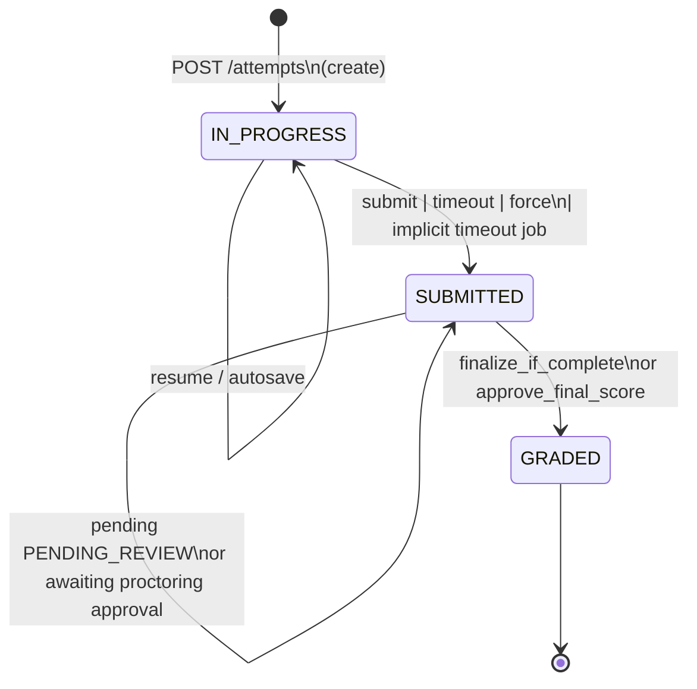

# QuizHub — نظام الاختبارات والتصحيح  
# Exam Attempts & Grading System (Current Behavior)

> **مرجع رسمي لسلوك النظام الحالي فقط**  
> Documented from the codebase as it exists today.  
> **No recommendations. No proposed changes.**

| | |
|---|---|
| Scope | Attempt lifecycle, grading, proctoring final-score approval, student result visibility |
| Auth envelope | JWT + `X-Workspace-Id` (`@require_workspace_membership`) unless noted |
| Source of truth | Routes → Services → Models listed below |

---

## جدول المحتويات / Contents

1. [نظرة عامة على دورة الحياة](#1-نظرة-عامة-على-دورة-الحياة)
2. [سجل الـ Endpoints](#2-سجل-الـ-endpoints)
3. [مقارنة `grading/manual` و `/grade`](#3-مقارنة-gradingmanual-و-grade)
4. [State Machine للمحاولة](#4-state-machine-للمحاولة)
5. [سيناريوهات التصحيح](#5-سيناريوهات-التصحيح)
6. [`approved` في `PATCH /grading/final-score`](#6-approved-في-patch-gradingfinal-score)
7. [حالات الطالب عبر المراحل](#7-حالات-الطالب-عبر-المراحل)
8. [المسار الشامل من البداية حتى التحليلات](#8-المسار-الشامل-من-البداية-حتى-التحليلات)
9. [خريطة الملفات](#9-خريطة-الملفات)

---

## 1. نظرة عامة على دورة الحياة

```text
Start/Resume → Answer (autosave) → Finalize (submit | timeout | force)
       → Auto-grade objective questions
       → [optional] Manual grade PENDING_REVIEW answers
       → [optional] Teacher approves/overrides proctoring final score
       → GRADED → Results / Recent Exams / Dashboard analytics
```

### حالات المحاولة في قاعدة البيانات (`test_attempts.status`)

| Value | Meaning |
|-------|---------|
| `IN_PROGRESS` | Student is taking the exam |
| `SUBMITTED` | Finalized; auto-grading done; may wait for essays and/or proctoring approval |
| `GRADED` | Grading complete; result ready for student surfaces that key off `GRADED` |

### حالات تصحيح الإجابة (`attempt_answers.grading_status`)

| Value | Meaning |
|-------|---------|
| `AUTO_GRADED` | Objective item graded on submit (`MCQ`, `TRUE_FALSE`, `MULTI_SELECT`) |
| `PENDING_REVIEW` | Needs teacher score (`ESSAY` and any non-objective type) |
| `MANUALLY_GRADED` | Teacher assigned `earned_score` via manual grading |

### مصادر التسليم (`submission_source`)

| Value | Trigger |
|-------|---------|
| `STUDENT` | `POST .../submit` |
| `TIMEOUT` | `POST .../timeout`, implicit deadline checks, or scheduled auto-submit job |
| `FORCE` | `POST .../force-submit` |

---

## 2. سجل الـ Endpoints

Role shorthand used below:

| Label | Who (as enforced in services) |
|-------|-------------------------------|
| **Student** | Attempt owner with student test access (`can_take_published_test` / assignment rules) |
| **Teacher** | Subject teacher, test creator, or workspace owner/ADMIN (`can_manage_test_attempts`) |
| **Viewer (grading)** | Same as teacher for viewing grading result (`can_view_attempt_grading`) |

---

### 2.1 `POST /tests/{test_id}/attempts`

| | |
|---|---|
| **الهدف / Purpose** | Start a new attempt or resume an existing `IN_PROGRESS` attempt |
| **Caller** | Student (also workspace managers who pass take-access checks) |
| **Request body** | None |
| **Route** | `router/attempt_routes.py` → `start_attempt` |
| **Service** | `AttemptService.start_or_resume_attempt` |
| **HTTP** | `201` if created, `200` if resumed |

**DB changes (new attempt):**

- Insert `test_attempts`: `status=IN_PROGRESS`, `started_at`, `last_activity_at`, `expires_at`
- May create proctoring session if enabled (`_maybe_start_proctoring`)

**Status:** _ → `IN_PROGRESS` (or unchanged if resume)

**Response (shape):** `{ message, resumed, attempt, exam meta..., student/teacher names... }`

---

### 2.2 Autosave answers (supporting lifecycle)

#### `PUT /tests/{test_id}/attempts/{attempt_id}/answers`

| | |
|---|---|
| **Purpose** | Bulk upsert answers while `IN_PROGRESS` |
| **Caller** | Student (owner) |
| **Body** | `{ "answers": [ { "test_question_id", "answer_text?", "selected_choice_indices?" } ] }` |
| **Service** | `AttemptService.save_answers` |
| **DB** | Upsert `attempt_answers` content fields; update `last_activity_at`. No grading fields |

#### `PATCH /tests/{test_id}/attempts/{attempt_id}/answers/{test_question_id}`

Same ownership/`IN_PROGRESS` rules; single-answer update via `AttemptService.update_answer`.

---

### 2.3 `POST /tests/{test_id}/attempts/{attempt_id}/submit`

| | |
|---|---|
| **Purpose** | Student finalizes the attempt and triggers grading pipeline |
| **Caller** | Student (must own the attempt) |
| **Body** | None |
| **Route** | `submit_attempt` |
| **Service** | `AttemptService.submit_attempt` → `_finalize_attempt` → `ExamGradingService.process_submission_grading` |

**Preconditions:**

- `status == IN_PROGRESS`
- Answer rules validated (`_validate_submission_answer_rules`)
- Timeout check may finalize first if deadline already passed

**DB changes:**

- `test_attempts`: `status=SUBMITTED`, `submitted_at`, `last_activity_at`, `submission_source=STUDENT`
- Auto-grade answers; recompute `raw_score` / `final_score` / `percentage` per rules
- Possibly `status=GRADED`, `graded_at` (if nothing pending and no proctoring approval wait)
- May set `grading_notification_sent_at` after email
- Terminate proctoring session
- Write grading audit log rows

**Status:** `IN_PROGRESS` → `SUBMITTED` (and possibly immediately → `GRADED`)

**Response:**

```json
{
  "message": "Attempt submitted",
  "attempt": { "...serialized attempt including questions/answers..." }
}
```

---

### 2.4 `POST /tests/{test_id}/attempts/{attempt_id}/timeout`

| | |
|---|---|
| **Purpose** | Client-reported timer expiry finalization |
| **Caller** | Student (owner) — same ownership path as submit |
| **Body** | None |
| **Service** | `AttemptService.timeout_attempt` → `submit_attempt(..., submission_source=TIMEOUT)` |

**ملاحظة مهمة / Important:** This path still runs `_validate_submission_answer_rules` (because it goes through `submit_attempt`).

**Contrast — implicit / job timeout:** `auto_submit_due_attempts` and `_check_and_apply_timeout` call `_finalize_attempt(..., TIMEOUT)` **directly** and **skip** answer-rule validation.

**DB / status:** Same grading pipeline as submit; `submission_source=TIMEOUT`.

---

### 2.5 `POST /tests/{test_id}/attempts/{attempt_id}/force-submit`

| | |
|---|---|
| **Purpose** | Teacher/admin forces finalize of a student attempt |
| **Caller** | Teacher (`can_manage_test_attempts`) |
| **Body** | None |
| **Service** | `force_submit_attempt` → `submit_attempt(..., FORCE)` |

**DB / status:** Same pipeline; `submission_source=FORCE`. Response message overridden to `"Attempt force-submitted"`.

Still validates answer rules (via `submit_attempt`).

---

### 2.6 `POST /tests/{test_id}/attempts/{attempt_id}/grading/manual`

| | |
|---|---|
| **Purpose** | Teacher assigns scores to answers in `PENDING_REVIEW` |
| **Caller** | Teacher |
| **Schema** | `GradeAttemptEssaysSchema` |
| **Service** | `AttemptService.grade_attempt_essays` → `ExamGradingService.grade_pending_answers` → `finalize_if_complete` |

**Request body:**

```json
{
  "answers": [
    {
      "test_question_id": 12,
      "earned_score": 7.5,
      "teacher_feedback": "Clear argument, missing citation"
    }
  ]
}
```

**Validation (service):**

- Attempt must be `SUBMITTED`
- At least one grade item
- Each `test_question_id` must currently be `PENDING_REVIEW`
- `earned_score` ≥ 0 and ≤ question `points`
- Optional `teacher_feedback`

**DB changes:**

- For each graded answer: `earned_score`, `grading_status=MANUALLY_GRADED`, `is_correct=null`, optional `teacher_feedback`
- Recompute attempt scores
- May transition to `GRADED` / set `graded_at`, or stay `SUBMITTED` (remaining pending / proctoring wait)
- Audit: `MANUAL_GRADING_STARTED`, `MANUAL_GRADING_COMPLETED`, possibly `ATTEMPT_FULLY_GRADED`

**Status before:** `SUBMITTED`  
**Status after:** `SUBMITTED` or `GRADED`

**Response:**

```json
{
  "message": "Attempt fully graded",
  "attempt": { "...full serialization..." }
}
```

Possible messages:

- `"Manual grades saved; attempt is still waiting for grading"`
- `"Attempt fully graded"`
- `"Manual grades saved"`

---

### 2.7 `POST /tests/{test_id}/attempts/{attempt_id}/grade`

See [section 3](#3-مقارنة-gradingmanual-و-grade). Legacy alias of `grading/manual`.

---

### 2.8 `GET /tests/{test_id}/attempts/{attempt_id}/grading/result`

| | |
|---|---|
| **Purpose** | Read grading outcome / waiting reason |
| **Caller** | Student (own) or grading Viewer |
| **Body** | None |
| **Service** | `AttemptService.get_grading_result` → `ExamGradingService.build_grading_result` |

**If `IN_PROGRESS`:** validation error (results only after submission).

**If `SUBMITTED` + pending essays:**

```json
{
  "grading_completed": false,
  "message": "<waiting for manual grading>"
}
```

**If `SUBMITTED` + awaiting proctoring final-score approval:**

```json
{
  "grading_completed": false,
  "message": "<waiting for proctoring final-score approval>"
}
```

**If `GRADED`:**

```json
{
  "grading_completed": true,
  "final_score": 46.0,
  "maximum_score": 50.0,
  "percentage": 92.0,
  "grading_summary": { "...counts by grading_status..." },
  "submitted_at": "...",
  "graded_at": "..."
}
```

**DB:** read-only.

---

### 2.9 `PATCH /tests/{test_id}/attempts/{attempt_id}/grading/final-score`

| | |
|---|---|
| **Purpose** | Teacher accepts or overrides proctoring-adjusted final score |
| **Caller** | Teacher |
| **Schema** | `ApproveFinalScoreSchema` |
| **Service** | `AttemptService.approve_final_score` → `ExamGradingService.approve_final_score` |

See [section 6](#6-approved-في-patch-gradingfinal-score) for `approved` semantics and examples.

**DB:** sets `final_score`, `percentage`, `status=GRADED`, possibly `graded_at`; audit `FINAL_SCORE_APPROVED` (+ `ATTEMPT_FULLY_GRADED` if first time); may send grading email.

---

### 2.10 `GET /tests/{test_id}/attempts/{attempt_id}/proctoring/grading-review`

| | |
|---|---|
| **Purpose** | Teacher preview of risk, penalty, and `suggested_final_score` before approval |
| **Caller** | Teacher |
| **Service** | `get_proctoring_grading_review` → `build_proctoring_grading_review` |
| **DB** | read-only |

Requires proctoring approval to be applicable for the attempt. Attempt must not be `IN_PROGRESS`. Answers must not be pending review.

**Response includes (among other fields):** `raw_score`, `maximum_score`, `proctoring` risk stats, `penalty`, `suggested_final_score`, `current_final_score`, `requires_teacher_approval`.

---

### 2.11 Related read endpoints (results after grading)

| Method | Path | Caller | Role in lifecycle |
|--------|------|--------|-------------------|
| `GET` | `/tests/{test_id}/attempts/{attempt_id}` | Owner or Teacher | Attempt detail; after `GRADED`, content gated by `allow_review_after_grading` |
| `GET` | `/tests/{test_id}/attempts` | Teacher | List attempts (no answer payloads) |
| `GET` | `/tests/{test_id}/attempts/current` | Student | Resume payload for `IN_PROGRESS` |
| `GET` | `/student/tests/results` | Student | Graded results list (`status=GRADED` only) |
| `GET` | `/student/recent-exams` | Student | Recent `SUBMITTED`/`GRADED` UI rows with score when graded |
| `GET` | `/student/dashboard` | Student | Analytics over `GRADED` attempts |

---

## 3. مقارنة `grading/manual` و `/grade`

| | `POST .../grading/manual` | `POST .../grade` |
|---|---|---|
| Router handler | `grade_pending_answers` | `grade_pending_answers_legacy` |
| Schema | `GradeAttemptEssaysSchema` | **same** |
| Service | `AttemptService.grade_attempt_essays` | **same** |
| Auth decorator | `@require_workspace_membership` | **same** |
| Teacher check | `_ensure_teacher_attempt_access` | **same** |
| Validation / grading logic | `ExamGradingService.grade_pending_answers` | **same** |
| Response | `{ message, attempt }` | **same** |

**الاستنتاج من الكود:**

- نعم — **نفس الوظيفة**.
- نعم — `/grade` هو **legacy alias** موثّق في التعليق:  
  `"Legacy alias for POST .../grading/manual (backward compatibility)."`
- لا يوجد اختلاف في validation أو business logic.

**للـ frontend مستقبلًا (حسب التسمية الحالية في الكود):**  
استخدم **`POST /tests/{test_id}/attempts/{attempt_id}/grading/manual`**.  
المسار `/grade` موجود للتوافق الخلفي فقط.

---

## 4. State Machine للمحاولة



### 4.1 `→ IN_PROGRESS`

| | |
|---|---|
| **When** | New row in `start_or_resume_attempt` |
| **Who** | Student start |
| **Conditions** | Test takeable; attempt limits; no conflicting completed max, etc. |

### 4.2 `IN_PROGRESS → SUBMITTED`

| | |
|---|---|
| **When** | `_finalize_attempt` |
| **Who / triggers** | Student submit; student timeout API; teacher force-submit; deadline auto-finalize |
| **Conditions** | Was `IN_PROGRESS`; then grading pipeline runs |

Immediately after setting `SUBMITTED`, auto-grading + `finalize_if_complete` may transition further to `GRADED` in the same request.

### 4.3 `SUBMITTED` يبقى `SUBMITTED`

يحصل في `finalize_if_complete` عندما:

1. **أي إجابة** ما زالت `grading_status = PENDING_REVIEW`  
   → recompute scores; stay `SUBMITTED`
2. **لا يوجد pending**، لكن  
   `ProctoringRiskService.requires_teacher_approval(test, attempt)`  
   و `final_score is None`  
   → stay `SUBMITTED` (waiting for `PATCH .../grading/final-score`)

`requires_teacher_approval` =  
`proctoring enabled on test` **AND** `attempt.proctoring_session is not None`.

لا يعتمد على وجود مخالفات. حتى بدون مخالفات، إذا وُجدت جلسة مراقبة، يبقى انتظار موافقة العلامة النهائية.

### 4.4 `SUBMITTED → GRADED`

| Path | Responsible | Conditions |
|------|-------------|------------|
| `finalize_if_complete` | System after submit or after last manual grade | No `PENDING_REVIEW`; not awaiting proctoring approval; sets `final_score = raw_score` path |
| `approve_final_score` | Teacher via `PATCH .../final-score` | Proctoring approval required; no pending answers; not already approved |

عند أول انتقال إلى `GRADED`: يُضبط `graded_at`؛ قد تُرسل رسالة بريد التصحيح مرة واحدة.

### 4.5 ما لا يحدث في الكود الحالي

- لا توجد حالة DB اسمها `WAITING_PUBLICATION` أو `PENDING_GRADING` (هذه تسميات UI فقط في Recent Exams: `PENDING_GRADING` عندما ليست `GRADED`).
- لا يوجد انتقال عكسي من `GRADED`.
- التصحيح اليدوي (`grade_attempt_essays`) يرفض أي حالة غير `SUBMITTED`.

---

## 5. سيناريوهات التصحيح

### Scenario 1 — أسئلة موضوعية فقط، بدون Proctoring

```text
POST /attempts
  → IN_PROGRESS
PUT/PATCH answers (optional)
POST /submit  (or timeout / force)
  → SUBMITTED
  → auto-grade all MCQ/TRUE_FALSE/MULTI_SELECT → AUTO_GRADED
  → no PENDING_REVIEW
  → proctoring approval NOT required
  → GRADED (+ graded_at, email once)
Student sees score via grading/result, recent-exams, /student/tests/results, dashboard
```

لا حاجة لـ `grading/manual` ولا لـ `grading/final-score`.

---

### Scenario 2 — يوجد أسئلة مقالية (قد يوجد معها موضوعية)

```text
POST /attempts → IN_PROGRESS
... answers ...
POST /submit
  → SUBMITTED
  → objective → AUTO_GRADED
  → ESSAY (answered or unanswered placeholder) → PENDING_REVIEW
  → finalize_if_complete keeps SUBMITTED
Teacher: POST .../grading/manual  (one or more calls until none pending)
  → MANUALLY_GRADED on those answers
  → when no PENDING_REVIEW left and no proctoring wait → GRADED
```

`GET .../grading/result` أثناء الانتظار: `grading_completed=false` + waiting-for-manual-grading message.

---

### Scenario 3 — Proctoring مفعّل، بدون مخالفات

حسب الكود الحالي (`requires_teacher_approval`):

```text
POST /attempts
  → IN_PROGRESS + proctoring session (if enabled)
... submit ...
  → auto-grade (± manual if essays)
  → when answers complete:
       final_score forced to null (approval required because session exists)
       status stays SUBMITTED
Teacher: GET .../proctoring/grading-review
  → risk typically 0 → suggested_final_score ≈ raw_score
Teacher: PATCH .../grading/final-score { "approved": true }
  → GRADED with final_score = suggested
```

**حتى بدون مخالفات**، وجود جلسة Proctoring يفرض خطوة موافقة المعلم على العلامة النهائية.

---

### Scenario 4 — Proctoring مع مخالفات (موافقة على الاقتراح)

```text
... same until answers complete ...
SUBMITTED, final_score = null
GET grading-review
  → risk_percentage > 0
  → penalty = raw_score * (risk/100)
  → suggested_final_score = max(0, raw_score - penalty)
PATCH final-score { "approved": true }
  → final_score = suggested_final_score
  → GRADED
```

---

### Scenario 5 — المعلم يرفض الاقتراح ويضع علامة يدوية

```text
... awaiting proctoring approval ...
PATCH final-score {
  "approved": false,
  "final_score": 40,
  "reason": "Severity overstated; student showed camera briefly"
}
  → final_score = 40 (must be provided; ≤ maximum_score)
  → GRADED
```

إذا `approved=false` بدون `final_score` → ValidationError.

---

## 6. `approved` في `PATCH /grading/final-score`

### Preconditions (service)

- Proctoring approval is required for this attempt
- Not `IN_PROGRESS`
- No `PENDING_REVIEW` answers
- Not already `final_score != null` with `status=GRADED`

### Schema

```json
{
  "approved": true,
  "final_score": null,
  "reason": "optional string"
}
```

| Field | Rules |
|-------|--------|
| `approved` | required boolean |
| `final_score` | optional float ≥ 0; **required when `approved=false`** |
| `reason` | optional; stored in audit details |

### `approved = true`

- `final_score` ignores body value; uses **`suggested_final_score`** from risk calculation
- Writes audit with `"approved": true`

**Example request:**

```json
{
  "approved": true,
  "reason": "Accept system suggestion"
}
```

**Example response:**

```json
{
  "message": "Final score approved successfully",
  "attempt_id": 91,
  "raw_score": 46.0,
  "suggested_final_score": 41.4,
  "final_score": 41.4,
  "modified_by": 15,
  "status": "GRADED"
}
```

### `approved = false`

- Requires body `final_score`
- Uses teacher value (rounded to 2 decimals), must be ≤ exam maximum
- Writes audit with `"approved": false` and optional `reason`

**Example request:**

```json
{
  "approved": false,
  "final_score": 44,
  "reason": "Dismissed false-positive tab switch"
}
```

**Example response:**

```json
{
  "message": "Final score approved successfully",
  "attempt_id": 91,
  "raw_score": 46.0,
  "suggested_final_score": 41.4,
  "final_score": 44.0,
  "modified_by": 15,
  "status": "GRADED"
}
```

بعد النجاح يُنادى `maybe_send_grading_notification` إذا كانت أول مرة تصل فيها المحاولة إلى `GRADED`.

---

## 7. حالات الطالب عبر المراحل

### 7.1 قبل التسليم (`IN_PROGRESS`)

| Surface | Behavior |
|---------|----------|
| Taking exam | Autosave allowed; scores typically null |
| `GET .../attempts/{id}` | Questions/answers present; choice correctness stripped for student own view |
| `GET grading/result` | Error — only after submission |
| Recent exams / results / dashboard | Attempt not treated as graded result |

### 7.2 بعد التسليم وقبل اكتمال التصحيح (`SUBMITTED`)

| Surface | Behavior |
|---------|----------|
| Submit response | Attempt serialized; may show partial `raw_score`/`percentage`; `final_score` null if proctoring wait |
| Recent exams | UI status `PENDING_GRADING`; `score: null`; `grading_completed: false` |
| `/student/tests/results` | **Not included** (GRADED only) |
| Dashboard analytics | **Not included** (GRADED only) |
| `GET grading/result` | `grading_completed: false` + waiting message |

### 7.3 انتظار التصحيح اليدوي

Same `SUBMITTED` state. Distinguisher:

- Answers with `PENDING_REVIEW`
- `GET grading/result` → waiting for **manual grading** message
- `requires_manual_grading` on attempt serialization may be true

### 7.4 انتظار موافقة Proctoring

Same `SUBMITTED` state. Distinguisher:

- No pending answers
- `final_score is null` while proctoring approval required
- `GET grading/result` → waiting for **proctoring final-score approval**
- Teacher uses grading-review + final-score endpoints

### 7.5 بعد `GRADED`

| Surface | Behavior |
|---------|----------|
| Scores | `final_score`, `percentage`, `graded_at` available |
| Recent exams | UI `GRADED` + score object; `review_allowed` reflects review setting |
| `/student/tests/results` | Included |
| Dashboard | Included in averages / pass-fail / subjects / weak topics |
| `GET .../attempts/{id}` | If `allow_review_after_grading=false`: scores/metadata only (`include_answers=False`); if `true`: full educational content |
| `GET grading/result` | `grading_completed: true` + score payload |

`allow_review_after_grading` **لا** يخفي الدرجة أو النتائج أو التحليلات — يمنع فقط محتوى المراجعة التعليمية في تفاصيل المحاولة.

---

## 8. المسار الشامل من البداية حتى التحليلات

```text
1) Student opens exam → POST /tests/{id}/attempts
2) Answers saved → PUT/PATCH .../answers
3) Finalize → POST submit | timeout | force-submit | server auto-timeout
4) System auto-grades objective questions
5) If essays remain → Teacher POST .../grading/manual (until none pending)
6) If proctoring session exists on enabled test
      → Teacher GET .../proctoring/grading-review
      → Teacher PATCH .../grading/final-score (approve or override)
7) Attempt becomes GRADED
8) Student sees outcome via:
      - GET .../grading/result
      - GET /student/tests/results
      - GET /student/recent-exams
      - GET /student/dashboard
9) Optional content review:
      - GET .../attempts/{attempt_id}
        only with educational payloads when allow_review_after_grading=true
```

هذا هو مسار **QuizHub** الكامل: من بدء المحاولة حتى ظهور النتيجة والإحصائيات اعتمادًا على `status = GRADED`.

---

## 9. خريطة الملفات

| Area | Path |
|------|------|
| Attempt routes | `router/attempt_routes.py` |
| Grading routes | `router/grading_routes.py` |
| Proctoring routes (grading-review) | `router/proctoring_routes.py` |
| Student results / recent / dashboard wiring | `router/student_routes.py` |
| Attempt runtime service | `service/attempt_service.py` |
| Grading workflow | `service/exam_grading_service.py` |
| Proctoring risk / suggested score | `service/proctoring_risk_service.py` |
| Proctoring sessions | `service/proctoring_service.py` |
| Schemas | `schemas/attempt_schema.py` |
| Status enums | `utils/enums.py` (`TestAttemptStatus`, `AnswerGradingStatus`, `AttemptSubmissionSource`) |
| RBAC | `utils/academic_rbac.py` |
| Review setting (content only) | `utils/review_settings.py` |
| Models | `models/test.py` (`TestAttempt`), `models/attempt_answer.py`, `models/attempt_grading_audit.py` |
| Auto-timeout job | `jobs/scheduled_test_publisher.py` (calls auto-submit) |
| OpenAPI | `swagger/template.yml` |

---

*End of document — behavior as implemented in the repository at documentation time.*
